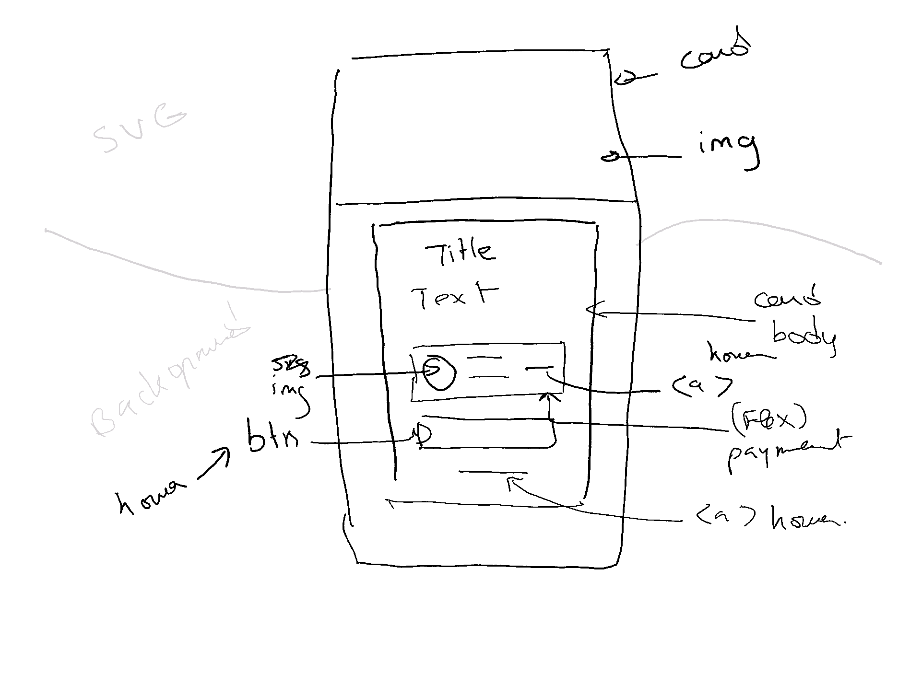

# Frontend Mentor - Order summary card solution

This is my solution to the [Order summary card challenge on Frontend Mentor](https://www.frontendmentor.io/challenges/order-summary-component-QlPmajDUj).

## Table of contents

- [Overview](#overview)
  - [The challenge](#the-challenge)
  - [Screenshot](#screenshot)
  - [Links](#links)
- [My process](#my-process)
  - [Built with](#built-with)
  - [What I learned](#what-i-learned)
  - [Continued development](#continued-development)
  - [Useful resources](#useful-resources)
- [Author](#author)
- [Acknowledgments](#acknowledgments)

## Overview

### The challenge

Users should be able to:

- See hover states for interactive elements

### Screenshot


### Links

- Solution URL: [Github](https://github.com/Mabchir/order_summary_component_challenge)
- Live Site URL: [Netlify](https://focused-edison-9eaa79.netlify.app/)

## My process

### Built with

- HTML
- CSS custom properties
- Flexbox

### Steps

- Sketch the design to prepare the different components 

### What I learned

To see how you can add code snippets, see below:

```html

```

```css

```

### Continued development

What I would love to learn more about is:

-

### Useful resources

- [Example resource 1](https://www.example.com) - This helped me for XYZ reason. I really liked this pattern and will use it going forward.
- [Example resource 2](https://www.example.com) - This is an amazing article which helped me finally understand XYZ. I'd recommend it to anyone still learning this concept.

## Author

- Website - [Mariem Bchir](https://goofy-easley-2c8717.netlify.app/index.html)

- Frontend Mentor - [@Mabchir](https://www.frontendmentor.io/profile/Mabchir)

- Github - [Mabchir](https://github.com/Mabchir)

## Acknowledgments

Shoutout to the following members of Frontend Mentors whose feedback on my first challenge was very helpful in making this challenge a success :

- Frontend Mentor - [@Phalcin](https://www.frontendmentor.io/profile/Phalcin)
- Frontend Mentor - [@denielden](https://www.frontendmentor.io/profile/denielden)
- Frontend Mentor - [@nakoyawilson](https://www.frontendmentor.io/profile/nakoyawilson)
- Frontend Mentor - [@AleksHNZ](https://www.frontendmentor.io/profile/AleksHNZ)
- Frontend Mentor - [@grace-snow](https://www.frontendmentor.io/profile/grace-snow)
