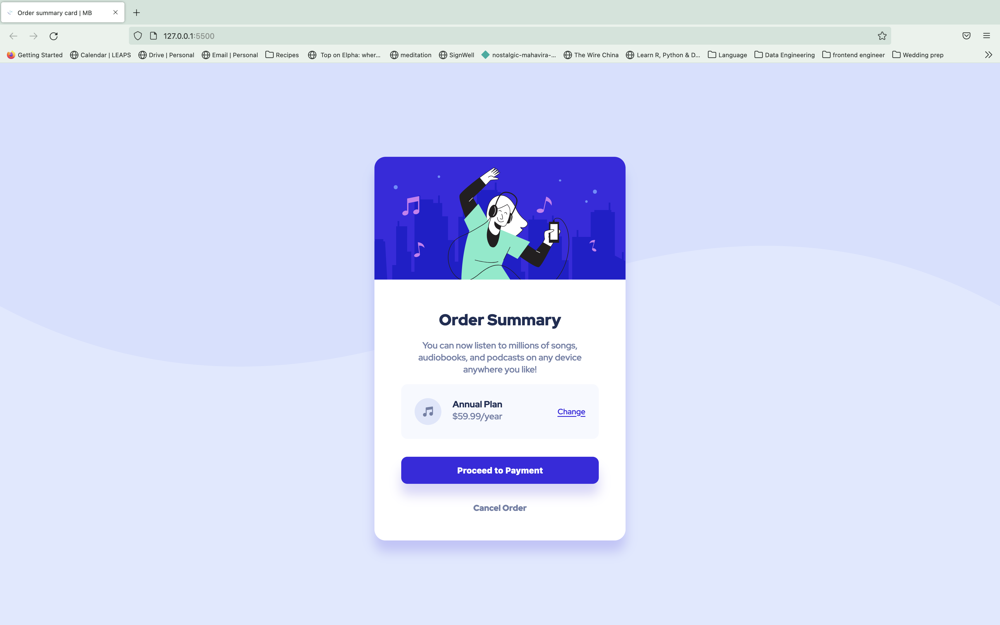
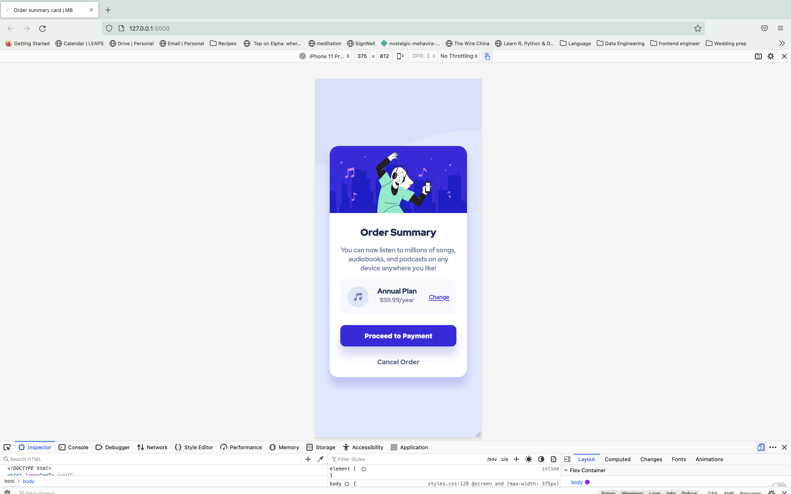

# Frontend Mentor - Order summary card solution

This is my solution to the [Order summary card challenge on Frontend Mentor](https://www.frontendmentor.io/challenges/order-summary-component-QlPmajDUj).

## Table of contents

- [Overview](#overview)
  - [The challenge](#the-challenge)
  - [Screenshot](#screenshot)
  - [Links](#links)
- [My process](#my-process)
  - [Built with](#built-with)
  - [What I learned](#what-i-learned)
  - [Continued development](#continued-development)
  - [Useful resources](#useful-resources)
- [Author](#author)
- [Acknowledgments](#acknowledgments)

## Overview

### The challenge

Users should be able to:

- See hover states for interactive elements

### Screenshot




### Links

- Solution URL: [Github](https://github.com/Mabchir/order_summary_component_challenge)
- Live Site URL: [Netlify](https://focused-edison-9eaa79.netlify.app/)

## My process

### Built with

- HTML
- CSS custom properties
- Flexbox

### Steps

- Sketch the design to prepare the different components 

- Set up the repository, live site and starter files
- created a sketch of the different components I will be needing 
- translated sketch into HTML
- added the class in CSS
- added relevant styling
- adding hovering styles
- fixing mobile responsiveness

### What I learned

To see how you can add code snippets, see below:

How to add an image as a part of the background

```css
body {
  background-image: url(../images/pattern-background-desktop.svg);
  background-repeat: no-repeat;
  background-size: 100% auto;
}
```

### Continued development

What I would love to learn more about is:

- a more efficient way of making things responsive to mobile screens instead of targetting each element and changing the spaces and sizes.

- I couldn't figure out how to get the right spacing for the plan class in the mobile format (screen 375 px)

### Useful resources

- [CSS Tricks](https://css-tricks.com/lodge/svg/06-using-svg-svg-background-image/) - This helped understand how to put an image as a background
- [W3Schools](https://www.w3schools.com/cssref/pr_background-position.asp) - This helped understand how to position the back ground image

- [XaxessLab](https://axesslab.com/alt-texts/)- learning about the importance of alt text in images

- [w3.org](https://www.w3.org/WAI/tutorials/images/) - learning about the different types of images and the best fit alt

-[MDN-Web-Doc](https://developer.mozilla.org/en-US/docs/Web/HTML/Element/br#accessibility_concerns) - learning about the `<br>` element and its uses

-[CSS-Tricks](https://www.youtube.com/watch?v=A2gGkE9r1GM&ab_channel=FredrikChristenson) - learing about how to do a css reset

```css
* {
  margin: 0;
  padding: 0;
  box-sizing: border-box;
}
```

-[engage](https://engageinteractive.co.uk/blog/em-vs-rem-vs-px) learning about the difference between em rem and px for font-sizing

## Author

- Website - [Mariem Bchir](https://goofy-easley-2c8717.netlify.app/index.html)

- Frontend Mentor - [@Mabchir](https://www.frontendmentor.io/profile/Mabchir)

- Github - [Mabchir](https://github.com/Mabchir)

## Acknowledgments

Shoutout to the following members of Frontend Mentors whose feedback on my previous challenge was very helpful in making this challenge a success :

- Frontend Mentor - [@grace-snow](https://www.frontendmentor.io/profile/grace-snow)
- Frontend Mentor - [@dnksebastian](https://www.frontendmentor.io/profile/dnksebastian)
- Frontend Mentor - [@MomenHakim](https://www.frontendmentor.io/profile/MomenHakim)
- Frontend Mentor - [@Crazimonk](https://www.frontendmentor.io/profile/Crazimonk)
